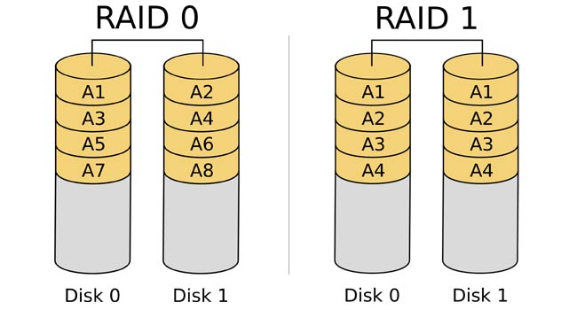
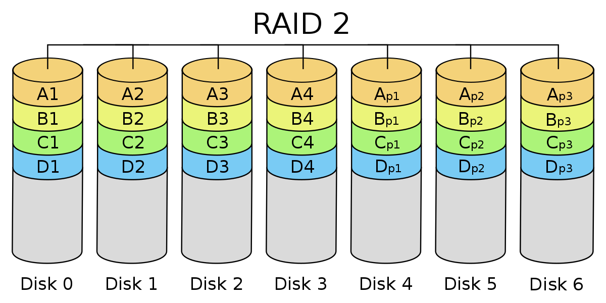
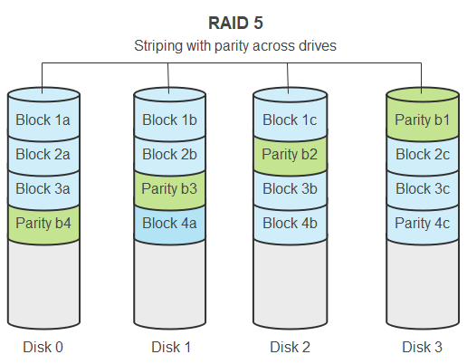
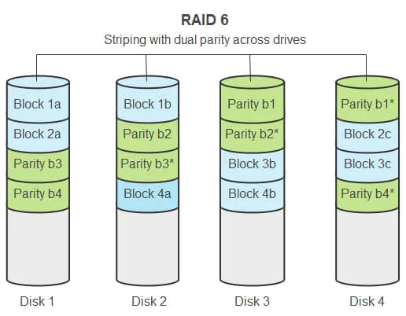
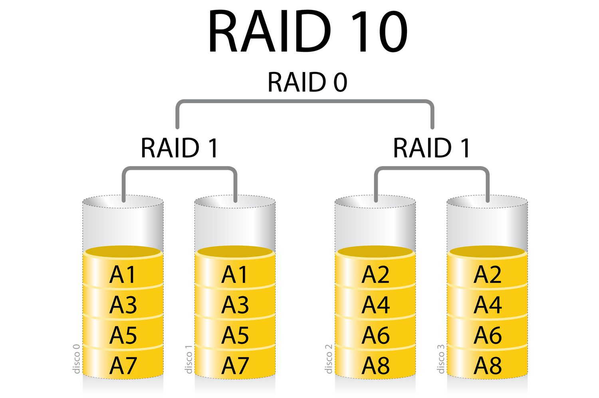
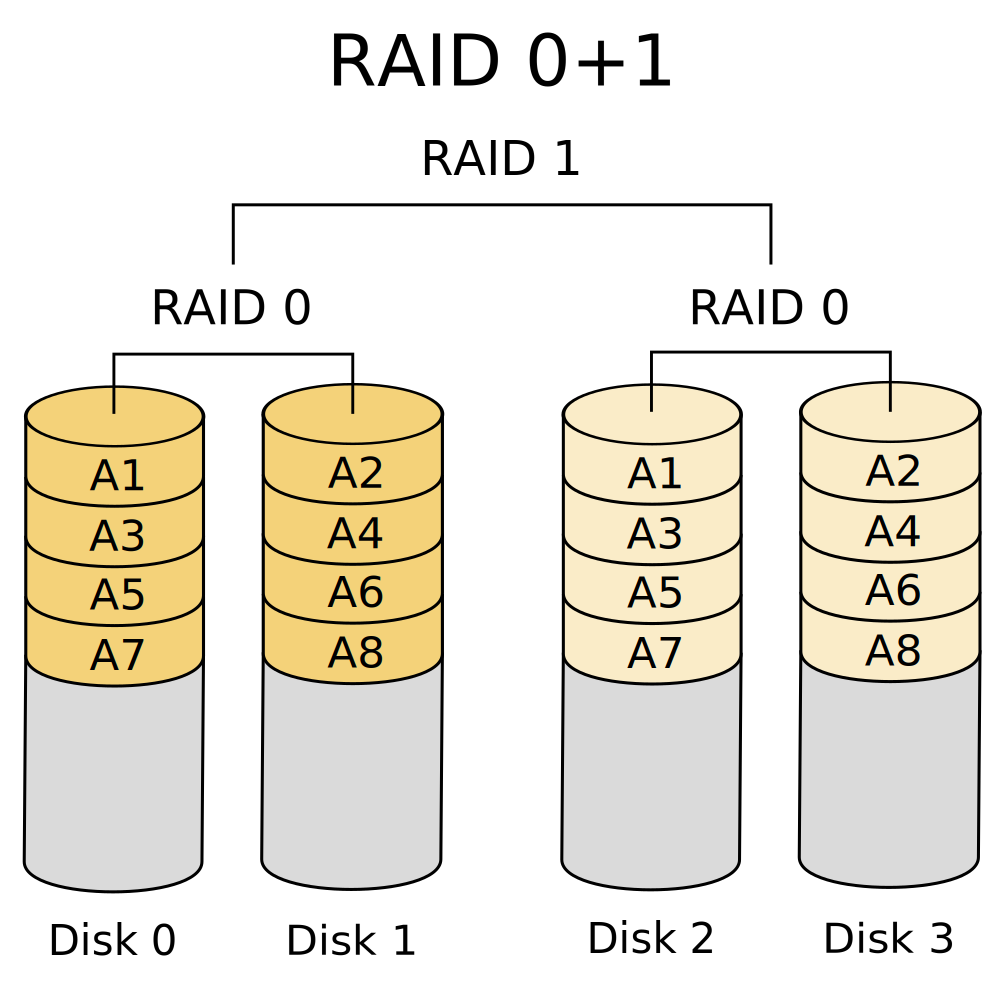
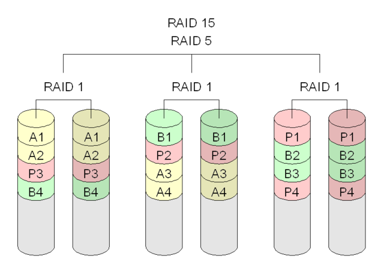

# Apuntes #1 - 21/2/2023
## Max Richard Lee Chung - 2019185076
### Continuación de la clase de componentes y procesamiento de datos.

#### Comportamiento del CPU
Los programas compiten por el uso de la CPU y como no hay hardware dedicado para la base de datos, la base debe de competir con otras aplicaciones en ejecución. 

En el pasado, las bases de datos se creaban a partir de tres capas: UI, Logic y Datos. Dentro de un server, se suele cometer el error de combinar capas, ya que entre más componentes se usen, el rendimiento disminuute por la cantidad de files descriptors que utiliza cada componente. 

Por lo general, los servidores se conectan por medio de redes públicas o privadas, en donde las públicas utilizan DMZ (zona desmilitarizada). Antes, se generaban muchos problemas al querer atacar a las bases de datos por medio de robots que atacan las redes o puertos para buscar vulnerabilidades y extraer información, por lo que se crearon protocolos de DoS (denial service) para proteger las conexiones. 

La localidad de los datos se define como el método para que los usuarios o clientes obtengan la información de forma contigua sin tener que esperar mucho tiempo. Dicho método se logra por medio de la configuración previa del máximo de datos coherentes que el usuario desee.

Lo ideal es que se puedan cargar una página de forma completa para que el trabajo del file system sea menor como, por ejemplo, extraer una tabla con sus respectivos datos para mostrar al usuario diferentes consultas de la misma. 

El rendimiento de la base de datos es mejor al optimizar la forma de guardado para evitar haer muchos saltos como en la búsqueda de árbol binario. 

La memoria virtual crea un espacio en disco pero más lento ya que usa una estrucutra diferente al árbol para buscar datos. Los cloud providers eliminan la memoria virtual porque las memorias virtuales degradan el rendimiento porque se tiene mucha carga de trabajo al tener que realizar varios swappings de la memoria virtual y memoria principal. 

SQL exige mucho al procesador/memoria por su estrucutra estricta de las tablas en sus consultas, por lo que se crearon formas para evitarlo. Una de ellas es agarrar una parte de la memoria de aplicación caché para almacenarla por su se ocupa volver a realizar la misma consulta sin tener que volver a conseguir los datos al disco o bases de datos.

La consistencia en SQL en vista del usuario consiste en que todos los clientes puedan visualizar la información a tiempo real, sin embargo, se gastan muchos recursos para poder lograr dicho objetivo. De esta forma, se utilizan las bases de datos no SQL para evitar el concepto de ACID (atomic, consistency, isolation y durability) que usan los SQL. 

#### Procesamiento de datos
Existen dos métodos de procesamientos de datos, los cuales son por streaming y batch. Dentro del procesamiento streaming, no es posible de realizar análisis de los datos de forma cómoda a menos que se utilicen ventadas en el flujo de datos en forma de eventos (intervalos almacenamiento o por tiempo) para analizar la información y guardar los datos en la base de datos, pero los usuarios pueden ver la info tarde si se usa un intervalo amplio de tiempo. 

La localidad de datos permite disminuir el tiempo de búsqueda de un usuario al tener los datos cercanos y continuos. 

El CPU core y thread define el nivel de paralelismo para atender n cantidad de tareas. Entre mayor sea la capacidad, mejor pero si se tiene poco caché, genera un cuello de botella a los procesos. 

Swapping es un método para intercambiar los procesos entre disco y memoria, sin embargo, es preferible evitar estos casos. 

IO bound está relacionado a cuándo duran los procesos de entrada y salida en durar. CPU bound está relacionado al rendering de juegos ya que gasta muchos recursos para procesar los datos. 

IOPs es una unidad de medida para analizar el rendimiento de entradas y salidas operativos por segundos de un disco. 

Big Data son datos que no entran o no pueden ser alojados en memoria principal. Este método utiliza una distribución de los datos con las mismas especificaciones para manejar la información entre las bases de datos. Se encuentran conectadas por via LAN (Local Area Network) en protocolo Ethernet. 

#### Clúster

Un clúster es un conjunto de computadoras con propósito general que funcionan como uno solo. 

Dentro de una red se pueden conectar muchos servidores pero no todos pueden ser iguales. Existen servidores master/main/primary quien es el coordinador de los demás. El resto son servidores slaves/stand by/secondary que esperan a que el master deje de funcionar o tiene una función en específico. Los esquemas multimaster reciben los pedidos de los usuarios para redireccionar al slave con la información solicitada. 

Scale-up es un método de aumento de memoria (requiere de una gran cantidad de dinero) para reemplazar o aumentar el viejo, sin embargo, al tener tanta memoria, el sistema operativo podría no saber dónde guardar la información. 

> Conceptos básicos del main frame:
> * Failover y switchover es una forma para mover el flujo o tránsito de datos de un servidor en mal estado a otro servidor activo, sin embargo, el failover se realiza de forma automática mientras que el switchover es manual y poco eficiente. 
> SLA (Service Level Agreement) define cuánto tiempo el servidor puede estar inactivo. 
> * Alta disponibilidad significa que el servidor se encuentra en funcionamiento sin importar las circunstancias.
> La replicación es una estrategia para crear copias de la información.
> Redundancia es una estrategia para copiar información y mantener una alta disponibilidad.

Scale-down es un método para distribuir la información en varios hardware con specificaciones bajas, no obstante, puede tener problemas con la red o coordición. Por lo anterior, se debe de nombrar un master por medio de la mayoría de votaciones de quién quiere ser el master conforme los servidores se activen para debatir y sincronizarse. En caso de un sistema distribuido con 3 servidores y si uno de ellos se cae, el sistema deja de funcionar y se denomina brain dead al tener los recursos pero sin poder funcionar.

#### Tipos de discos
* HDD (Hard Drive Disk): Son muy lentos y tienen un bajo precio en el comercio. Tienen un eje con varios platos con un brazo lector y múltiples cabezas.
* SSD (Solid State Disk): Son muy rápidos y tienen un límite de lectura de datos. 

#### Raid levels
* Raid 0: Este método aumenta la capacidad del servidor por medio del stripping. El stripping es agarrar la información y las particiona de forma equitativa entre los discos. Dicho método sirve dentro de bases de datos con lecturas paralelas eficientes pero para cuestiones de escritura, puede tardar más. 

* Raid 1: Llamado también mirror (espejo), ya que los datos son almacenados en varios discos diferentes y tiene el beneficio de perder un disco.

* Raid 2: Hace lo mismo que el Raid 1 pero las porciones de cada dato los guarda por 1 bit.

* Raid 3: Hacec lo mismo que el Raid 2 pero por bytes con buses más grandes.

* Raid 4: Define arbitrariamente el tamaño del disco 

* Raid 5: Separa el disco por bloques definidos por el usuario, el cual usa hexores entre los discos para generar un solo disco perdido.

* Raid 6: Hace lo mismo que el Raid 5 pero se le puede añadir más discos para realizar los hexores. 

#### Jerarquías de Raids
* Raid 10: Realiza una combinación de un Raid 0 y discos de Raid 1 para poder crear espejos con la posibilidad de perder un disco entero de tipo Raid 1.

* Raid 0 + 1: Realiza una combinación de un Raid 1 y discos con Raid 0 para poder distribuir los datos entre los discos con la posibilidad de perder una rama de subdiscos del Raid 0. 

* Raid 15: Realiza una combinación de Raid 5 con mirror. 

